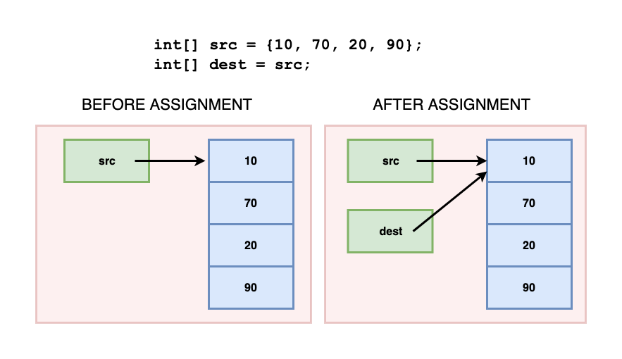
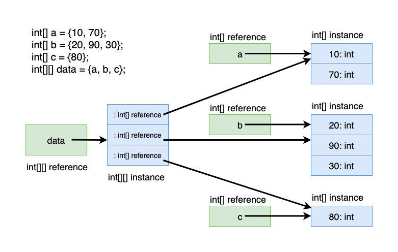
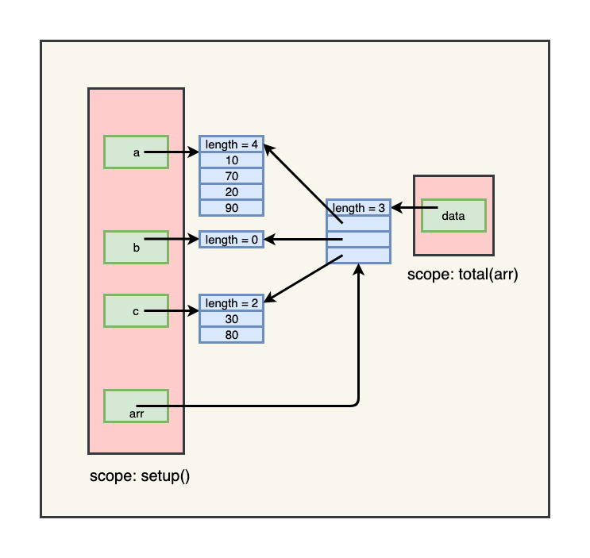
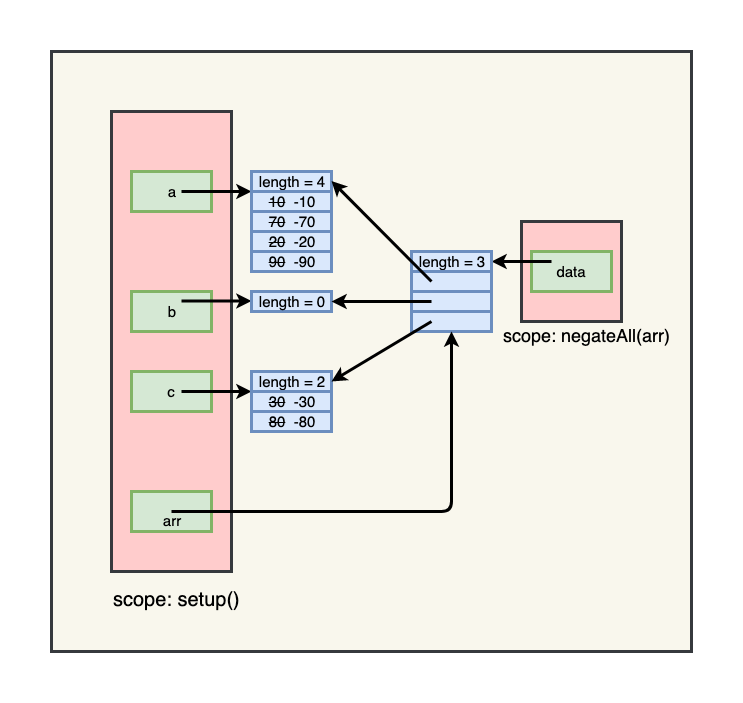

<details class="prereq" markdown="1"><summary>Assumed Knowledge</summary>

  * <a href="compound_data">Compound Data</a>
</details>

<details class="outcomes" markdown="1"><summary>Learning Outcomes</summary>

  * Understand how to create a and operate on multi-dimensional arrays.
</details>

# Author: Gaurav Gupta

### The biggest mistake people make while studying 2-dimensional arrays is visualizing them as rows and columns. 


Stay with me for a bit and see why should you let go of the *rows* and *columns* approach and adapt and *sets* approach.

Lets go through basic arrays and build up to 2-dimensional arrays.

1.  It’s critical to understand the concept of `reference` and `instance`. In the following code, `src` and `dest` are two references that refer to the same instance that is the collection of values 10, 70, 20, 90 (and the length attribute is also tucked away somewhere).

	```processing
	    int[] src = {10, 70, 20, 90};
	    int[] dest = src;
	```

	  

	(Above example is from the lecture notes, btw)  
	
	In the following code, there are three references, each referring to its own instance.

	```processing
	    int[] a = {10, 70};
	    int[] b = {20, 90, 30};
	    int[] c = {80};
	```

2.  An array can have ANY VALID type. So, the most generic syntax of an array is:

	```
	    Type[] arrayName = new Type[size];
	    //or
	    Type[] arrayName = {item1, item2, ...}; //where each item is of type Type
	```

2.  An array is itself a data type.    
3.  So if `Type` is `int[]`, we have:
    
	
	```processing
	    int[][] data = {a, b, c}; //since a, b, c are each int[]
	```

	  


*   `data` has 3 items, each of type `int[]` inside it.
*   First item of data (`data[0]`) is of type `int[]` and has 2 items (10 and 70), each of type `int` inside it.
*   Second item of data (`data[1]`) is of type `int[]` and has 3 items (20, 90 and 30), each of type `int` inside it.
*   Third item of data (`data[2]`) is of type `int[]` and has 1 item (80), each of type `int` inside it.

Now, we can go through each item in `data` using:

```processing
    for(int i=0; i < data.length; i++) {
       //access to data[i] which is of type int[]
```

If it helps you understand better, you can copy the current array into a local variable.

```processing
    for(int i=0; i < data.length; i++) {
        int[] current = data[i]; //current is a reference copy of data[i]
    }
```

Then we can go through each item of current as well!

```processing
    for(int i=0; i < data.length; i++) {
        int[] current = data[i]; //current is a reference copy of data[i]
        for(int k=0; k < current.length; k++) { //I (as in Gaurav, not int i) like to use k instead of j
            print(current[k]+" ");
        }
        println();
    }
```

The above will output:

```
    10 70
    20 90 30
    80
```

Now, if we back substitute `current` with `data[i]`, we get,

```processing
    for(int i=0; i < data.length; i++) {
        for(int k=0; k < data[i].length; k++) { 
            print(data[i][k]+" ");
        }
        println();
    }
```

*   If we need to find the total of all the items:

```processing
    int total = 0;
    for(int i=0; i < data.length; i++) {
        for(int k=0; k < data[i].length; k++) { 
            total+=data[i][k];
        }
    }
```

*   If we need to find the highest value:

```processing
    int highest = Integer.MIN_VALUE; //to override if and only if required
    for(int i=0; i < data.length; i++) {
        for(int k=0; k < data[i].length; k++) { 
            if(data[i][k] > highest) {
                highest = data[i][k];
            }
        }
    }
```

Note, you can also create the same array as:

```processing
    int[][] data = { {10, 70}, {20, 90, 30}, {80}} ;
```

So… why did I say that you shouldn’t think of 2-d arrays in terms of rows and columns? Because, as you see, not each sub-array needs to have the same number of items. Even if you ignore that (which you shouldn’t), while the above is easily to visual, the following is not:

```processing
	// assuming data is a two-dimensional array (int[][])
	int[][][] mega = { data, { {50}, {30, 60} } };
```

## Example of passing multi-dimensional array to a function

```processing
	void setup() {
		int[] a = {10, 70, 20, 90};
		int[] b = {};
		int[] c = {30, 80};
		int[][] arr = {a, b, c};
		int sum = total(arr);
		println(sum);
	}
	
	int total(int[][] data) {
		int result = 0;
		for(int i=0; i < data.length; i++) {
			for(int k=0; k < data[i].length; k++) {
				result+=data[i][k];
			}
		}
		return result;
	}
```




## Example of modiying contents of a multi-dimensional array in a function

```processing
	void setup() {
		int[] a = {10, 70, 20, 90};
		int[] b = {};
		int[] c = {30, 80};
		int[][] arr = {a, b, c};
		negateAll(arr);
		//arr becomes { {-10, -70, -20, -90}, {}, {-30, -80} }
	}
	
	void negateAll(int[][] data) {
		int result = 0;
		for(int i=0; i < data.length; i++) {
			for(int k=0; k < data[i].length; k++) {
				data[i][k]*=-1;
			}
		}
	}
```




## Challenging question 1

What is the state of the array `arr` inside `setup()` after `reset1` is called?

```processing
	void setup() {
		int[] a = {10, 70, 20, 90};
		int[] b = {};
		int[] c = {30, 80};
		int[][] arr = {a, b, c};
		reset1(arr);
		//what are the contents of arr here?
	}
	
	void reset1(int[][] data) {
		int result = 0;
		for(int i=0; i < data.length; i++) {
			for(k=0; k < data[i].length; k++){
				data[i][k] = new int[4];
		}
	}
```

## Challenging question 2

What is the state of the array `arr` inside `setup()` after `reset2` is called?

```processing
	void setup() {
		int[] a = {10, 70, 20, 90};
		int[] b = {};
		int[] c = {30, 80};
		int[][] arr = {a, b, c};
		reset2(arr);
		//what are the contents of arr here?
	}
	
	void reset2(int[][] data) {
		data = { {1, 2}, {3, 4} };
	}
```

