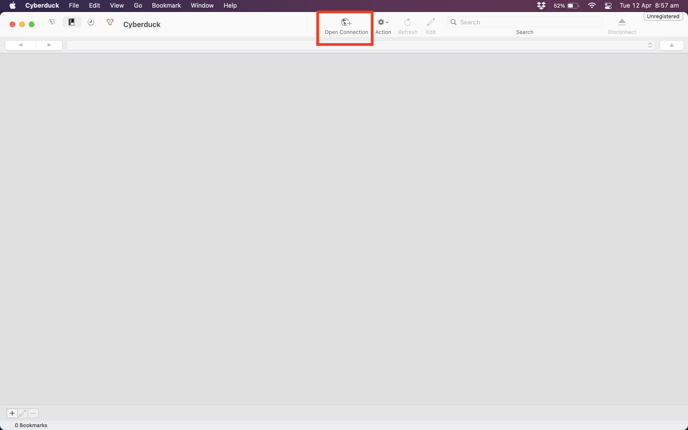
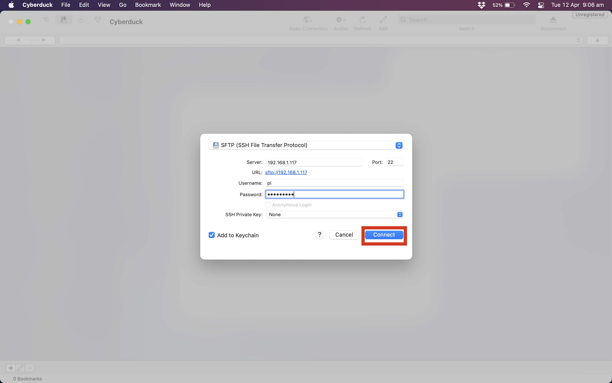

basic instructions for getting a RaspbarianLite image and installing the required libraries

We are going to create an embedded "detector" using machine learning techniques. We will implement it on embedded hardware so real-time detection can be performed anywhere at any time. Lets call this device the "spot-a-tron" (SaT)

The SaT is a Raspberry Pi setup with the right libraries, applications, and running our machine learning models. Much of the initial work is done and you will be working from that starting point.

The embedded hardware we are using is the Raspberry Pi, so our first step is to get a working Pi.

# Background to Raspberry Pi

Raspberry Pi is a small sized computer that can essentailly perform the same tasks as our computers at home. The device can be plugged into a monitor and controlled with a keyboard and mouse to be used as a fully functioning computer. It is low-cost, modular, and high performing, originally developed for teaching purposes for computer science students but growing into much more.

<div style="width:50%; margin:auto">
	
</div>

Learn more about Raspberry Pi at these links below:

<ol>
	<li><a href="https://en.wikipedia.org/wiki/Raspberry_Pi">https://en.wikipedia.org/wiki/Raspberry_Pi</a></li>
    <li><a href="https://thepihut.com/blogs/raspberry-pi-tutorials/the-raspberry-pi-tutorial-beginners-guide">https://thepihut.com/blogs/raspberry-pi-tutorials/the-raspberry-pi-tutorial-beginners-guide</a></li>
    <li><a href="https://www.edureka.co/blog/raspberry-pi-tutorial/">https://www.edureka.co/blog/raspberry-pi-tutorial/</a></li>
</ol>

# Setting up the Raspberry Pi for SaT

Our Raspberry Pi will use a SD card as the operating system. The SD card normally uses an operating system call 'Raspbarian', which is designed specifically for Raspberry Pi's. There are actually multiple variants of Raspbarian, the right one for us is "Rasparian Lite (32 bit)". Follow the steps below to set up the mini console onto our Raspberry Pi.

- [Installing a Fresh Operating System](https://www.raspberrypi.com/software/)

# Using Raspberry Pi

To use Raspberry Pi, we need a monitor to view what we are doing, as well as a keyboard and mouse to control it. Follow the steps below to connect and boot up the Raspberry Pi. Make sure you have read the links at the top of the page and understand what Raspberry Pi is and how it works before completing these steps.

<ol>
	<li>Insert the SD card into the SD card slot.</li>
	<li>Connect a monitor to the HDMI port. Make sure the monitor is connected to a wall socket and is powered on. The Raspberry Pi is still off, so you won’t see anything yet.</li>
    <li>Connect a keyboard to a USB port.</li>
    <li>If you want to connect to the Internet via Ethernet instead of WiFi, you should also plug in an Ethernet cable. The Raspberry Pi we have provided will allow to connect to Internet wirelessly</li>
    <li>Connect the power supply to a wall socket and plug in the micro USB cable. A red LED will light up on the Raspberry Pi, and on the monitor you will see the Raspberry Pi booting up. In a few moments you will see the login prompt.</li>
</ol>

You boot into any fresh Pi with

- username: `pi`
- password: `raspberry`

The only way to work in Raspabarian Lite is via the terminal. In the next worksheet we will learn more about how to work in the terminal, but we will get a sneak preview here as we get the libraries and appliations that we need installed.

<a href="https://projects.raspberrypi.org/en">Here</a> are some resources to show all the other projects you could do with a Raspberry Pi.

## Terminal Preview

One you have logged in, type `ls` exactly as it is written here, then press enter. This will give you a list of files and directories that the Raspberry Pi holds.

# Installing the Required Libraries/Tools

Next we need to install the libraries and tools that we will be using. First we should update the pi. We can do this by running:

```
sudo apt-get update
sudo apt-get upgrade
```

Then we will need to install the following libraries:

- `git`: So we can grab the code from Bitbucket
- `pip`: The python package manager - this is how we will install the majority of our python libraries.
- `python3-numpy`: We need to install this for compatability reasons.
- `libjpeg-dev`: We need to install this for the python library `Pillow`

```
sudo apt-get install git pip python3-numpy libjpeg-dev
```

Finally we can finish by using `pip` to install out python libraries:

- `tflite-runtime`: Tensorflow lite
- `Pillow`: For inteacting with images.

```
pip install tflite-runtime Pillow
```

# Installing the camera

You have been supplied with a Pi "NoIR" camera module. The following animation (from the offical raspberry pi website) shows how to connect it.


We will need to dig a bit deeper into how to use the Pi before we can start getting images off the camera.

# Getting things on and off the Pi

At this point you have the Pi connected to the internet, you can see the terminal via the monitor and you can send information to it via the keyboard.

When we cloned with git, we went to the web to get the data, but we were not using a web browser. It is quite hard to navigate the world without a web browser these days and you will want one soon. In these circumstances, it is best to access the Pi from another computer and to send/read files from that computer or copy/paste commands.

To do so, we need to access the Pi via _ssh_ over the _local network_.

## Enable SSH

At the terminal, enter

```
sudo raspi-config
```

This will launch the rasperry pi configuration tool. Under `3 Interface Options`, choose `12 SSH` to enable ssh and select `Yes`. You can close the configuration program and reboot now with `shutdown -r now`.

You might get a warning about security of SSH with the default password - don't worry about this just now, but perhaps consider changing it. `sudo raspi-config` is your path to a new password as well.

{:.keypoint}
When SSH is enabled, anyone on your network can connect to your computer if they know the user and password. Since everyone knows the default raspberry pi user and password you are at the mercy of your network-mates if you don't adjust the password.

## Getting Network Address

If you have connected the Pi to the network, it has an address given by the Uni systems. You can find this address by typing

```
hostname -I
```

Into the terminal.

TODO: need to do this on pi to see what it says and finish this section. You have to cover windows and mac, which is a pain. Don't forget to explain how to ftp in! You might also quickly demo how to copy/paste into that terminal so you can use the browser.

## Connecting to the pi via SFTP

SFTP ([Secure File Transfer Protocol](https://en.wikipedia.org/wiki/SSH_File_Transfer_Protocol)) is a way to access the pi's filesystem through SSH. To connect to our pi this way, we will be using [Cyberduck](https://cyberduck.io). Cyberduck will allow us to view the pi's filesystem in the same way as we view the local file system on our computer. First, you will need to install Cyberduck from [here](https://cyberduck.io).

Once installed open Cyberduck and you will see an empty screen. **Note** I'm performing this step on a Mac but the steps are identical for both Windows and Linux machines.


Next we want to setup a new connection with the pi, which we can do by clicking on the the `Open Connection` button highlighted below in red.



This will bring up a menu to setup the connection.

- Select `SFTP (SSH File Transfer Protocol)` in the top drop-down menu.
- Enter the IP address of the raspberry pi that you got in the last section from running `hostname -I`. You can leave the port unchanged.
- Enter the username for the pi, which should be `pi` (unless you've changed it).
- Enter the password for the pi, which should be `raspberry` (unless you've changed it).
- Make sure the `SSH Private Key` is set to `None`
- Click `connect`!



Once you click connect, it might take a while to mount. Once it's mounted you should see be able to see the raspberry pi's home directory. To test the connection works, try drag-n-dropping an image into the home directory. You can double check this by running the `ls` command on the pi, which should show the file.

# Next Steps

You may have noticed we use Terminal a lot within this project. If you have not used a terminal much in the past, we recommend you make [this worksheet](https://medium.com/@grace.m.nolan/terminal-for-beginners-e492ba10902a) your next stop. After that, move on to [Getting the Code](getting_code.html).
